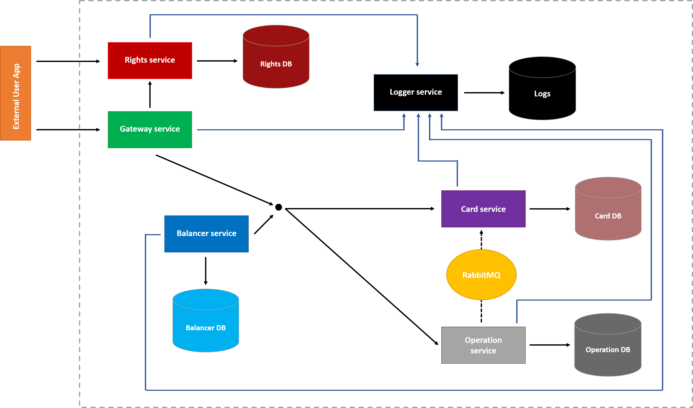
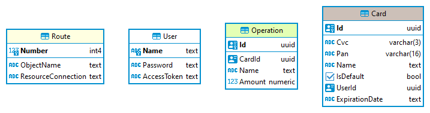

# Card Management Service
## L02

- Create and set up a template project
- Set up the configuration from file and environment variables
- Middleware for logging requests
- Middleware for adding and getting cards for user
- Store data in memory
- Card model:
  - Id
  - CVC
  - Pan (card number)
  - Expire (expiration date)
    - Month
    - Year
  - Name (card name, user-defined)
  - IsDefault (whether the card is default payment card)
  - UserId

## [Use multiple environments in ASP.NET Core](https://docs.microsoft.com/en-us/aspnet/core/fundamentals/environments?view=aspnetcore-5.0)
```PowerShell
$Env:ASPNETCORE_ENVIRONMENT = "Development"
dotnet run --launch-profile "Development"

$Env:ASPNETCORE_ENVIRONMENT = "Staging"
dotnet run --launch-profile "Staging"

dotnet run --no-launch-profile
```

## L03

- Added controllers for:
  - adding a card
  - deleting a card
  - getting a card or cards
  - changing card's name
- Configured swagger
- Added filters for logging requests and responses which hides card's secret data:
  - only 4 last digits of the pan is shown
  - CVC is hidden completely
- Added validation in one base model:
  - Luhn algorithm
  - card expiration date
  - during adding (including exceptions)

## L04, L05

- Added 
  - Entity Framework (EF) Core
  - PostgreSQL DB
  - Repository pattern for interaction with DB
- Removed
  - In-memory data

## L06

- Added controller for Operations
  - Get (CardId param is optional)
    - /operation?cardId
    ```json
    {
        "cardId": "d29f2fb4-409c-40b0-ad1e-4baa1758ea8e",
        "name": "operation02",
        "amount": 2
    }
    ```
  - Add operation with default card (Default card should exist)
    - /operation 
    ```json
    {
        "name": "operation02",
        "amount": 2
    }
    ```
  - Add operation with cardId. CardId should exist
    - Post /operation
    ```json
    {
        "cardId": "d29f2fb4-409c-40b0-ad1e-4baa1758ea8e",
        "name": "operation02",
        "amount": 2
    }
    ```
  - Add operation with new card
    - Post /operation
    ```json
    {
        "name": "operation01",
        "amount": 1,
        "card": {
            "pan": "4929722798964846",
            "expire": {
                "Month": 1,
                "Year": 2022
            },
            "cvc": "132"
        }
    }
    ```
- The application was created taking into account [12 factors](https://12factor.net/)

## L07

- Added
  - [Docker](https://docs.docker.com/)
  - [Docker Compose](https://docs.docker.com/compose/)

## L08

- Created a new service of operations
- Operations API has been moved to a new service
- When carrying out an operation using new details, an asynchronous message is sent about the creation of a new card (the card Id is generated in the operation service).
  - RabbitMQ message broker
  - EasyNetQ library
- When carrying out an operation by card Id, the default card is requested synchronously
- The default card for transactions is requested synchronously

## L09-10

- For HTTP communication between map services and operations, a policy has been configured using the Polly library for:
  - Retry
  - Circuit Breaker

# Diagrams
## Architecture



## DB



# Data

## Rights Db (User)

|  Name | Password | AccessToken |
|:-----:|:--------:|:-----------:|
| Admin |   1234   |    qwerty   |

## Balancer DB (Route)

| Number | ObjectName |        ResourceConnection       |
|:------:|:----------:|:-------------------------------:|
|    1   |    card    |      `{card-service}`/card      |
|    2   |  operation | `{operation-service}`/operation |

|    #   |         `{card-service}`         |         `{operation-service}`         |
|:------:|:--------------------------------:|:-------------------------------------:|
|  debug |      https://localhost:44333     |        https://localhost:44395        |
|   IIS  | http://localhost/cardDataService | http://localhost/operationDataService |
| docker |        http://card-service       |        http://operation-service       |

## Card Db (Card)

|                  Id                  | Cvc |        Pan       |  Name  |      IsDefault     |                UserId                | ExpirationDate |
|:------------------------------------:|:---:|:----------------:|:------:|:------------------:|:------------------------------------:|:--------------:|
| d29f2fb4-409c-40b0-ad1e-4baa1758ea8e | 001 | 4360251111335365 | card01 | :heavy_check_mark: | 65ebe5d1-a883-46e2-805a-4c2d44eab438 |     12/2099    |
| 57d92bd8-413e-4377-8de2-f69d57ece143 | 002 | 4024007173305771 | card02 |         :x:        | 65ebe5d1-a883-46e2-805a-4c2d44eab438 |     06/2026    |
| e0c6d6a1-5386-4690-9d63-23964e4be74f | 003 | 2720473437781424 | card03 | :heavy_check_mark: |  3fa85f64-5717-4562-b3fc-2c963f66afa |     05/2025    |

## Operation Db (Operation)

|                  Id                  |                CardId                |   Name   | Amount |
|:------------------------------------:|:------------------------------------:|:--------:|:------:|
| 48310dbe-a8b8-47b0-a21f-3180f656ce35 | d29f2fb4-409c-40b0-ad1e-4baa1758ea8e |  Petrol  |  1200  |
| 29d9170f-f06b-4c6f-ae9a-7f427517f171 | 57d92bd8-413e-4377-8de2-f69d57ece143 | Products |  2500  |
| 86fe5988-d76f-45ae-aefa-fe2dfd7e0e49 | e0c6d6a1-5386-4690-9d63-23964e4be74f |   Phone  |  37000 |